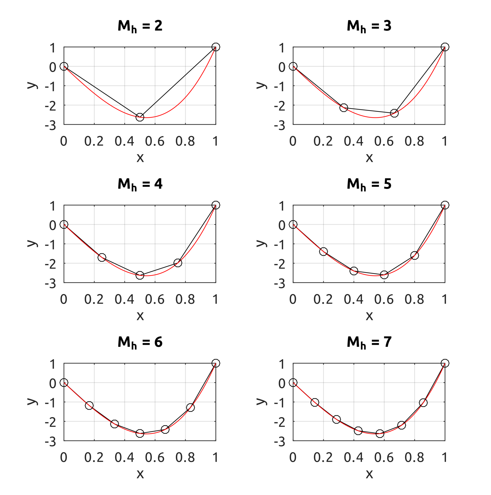

## drawFEM1DExample

This script is an example of how to use FEM to approximate the solution of the PDE problem:

    u''(x) = 10
    u(0) = 0
    u(1) = 1

with increasing number of elements in the mesh. It is clear how, refining the mesh, we get closer to the exact solution (drawn in red).

The second script solves the problem:

    1/50*u''(x) = x
    u(0) = 0
    u(1) = 1

