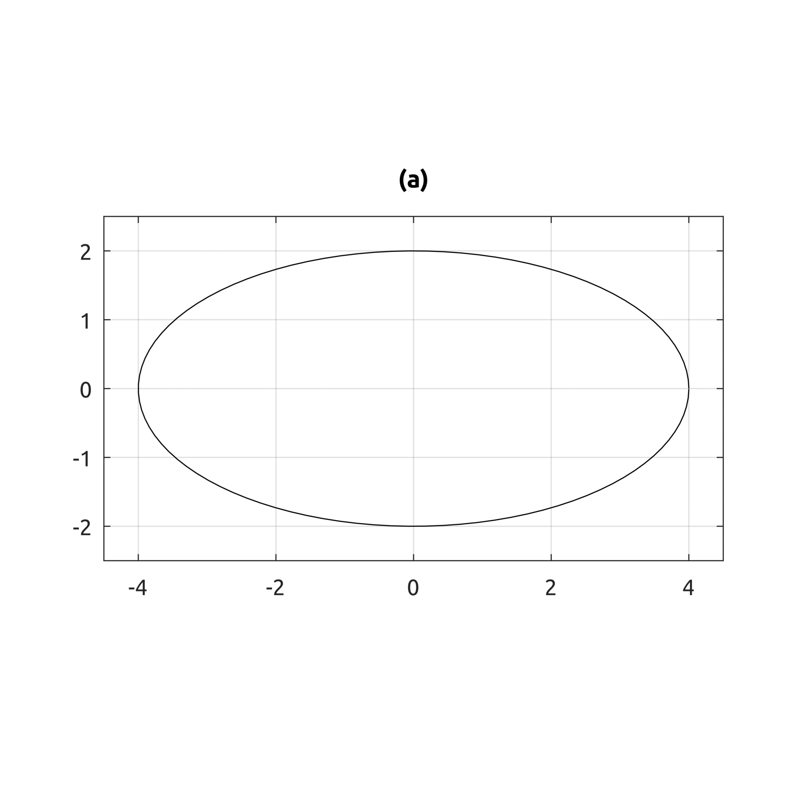

## Analytical Representation
Examples of representations of curves.
### drawEllipseImplicit
Draws an ellipse with implicit equation.
### drawEllipseParametric
Draws an ellipse with parametric equation.

### drawSphereImplicit
Draws a sphere with implicit equation.
### drawSphereParametric
Draws a sphere with parametric equation.

