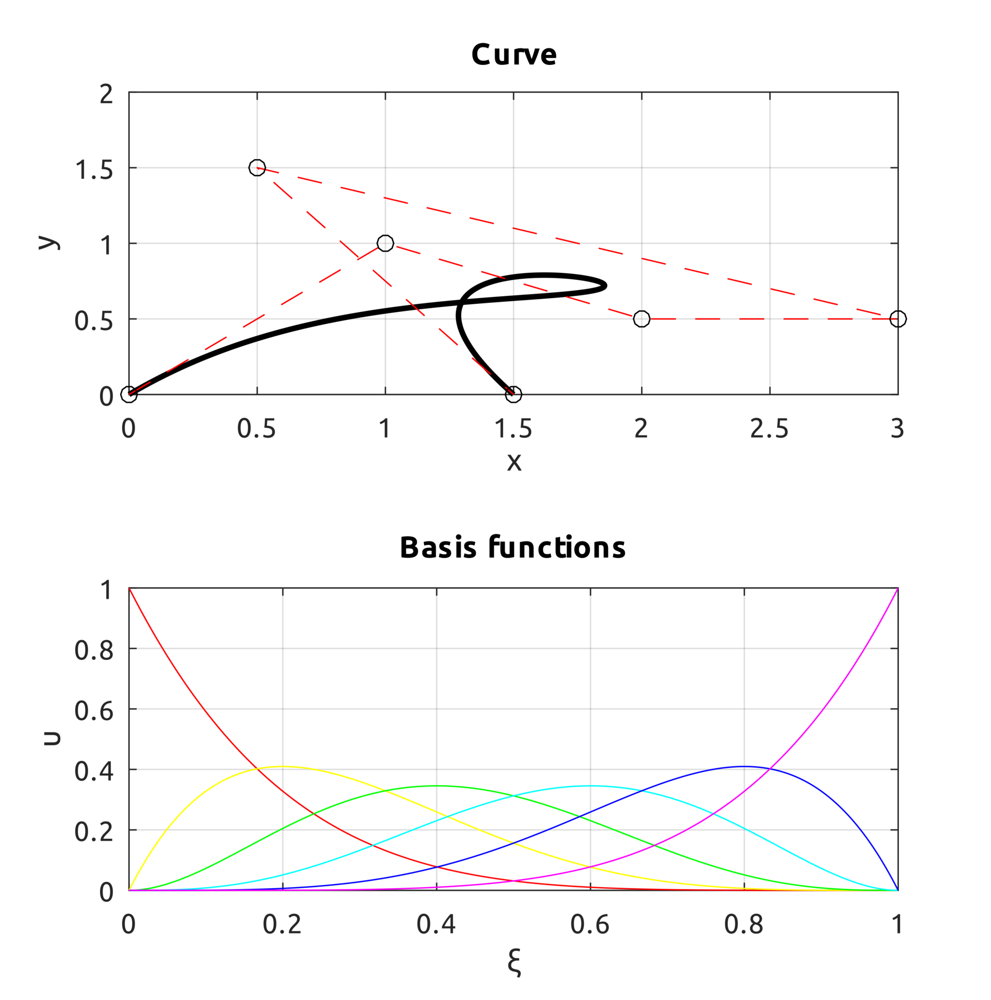

## Bézier

### computeBezier
Computes the Bézier curve with Bernstein polynomial.
### drawBezierCurve
Draws the curve, control points and basis functions.
### drawBezierCurve2d

### drawBezierCurve3d

### drawBezierSurf
