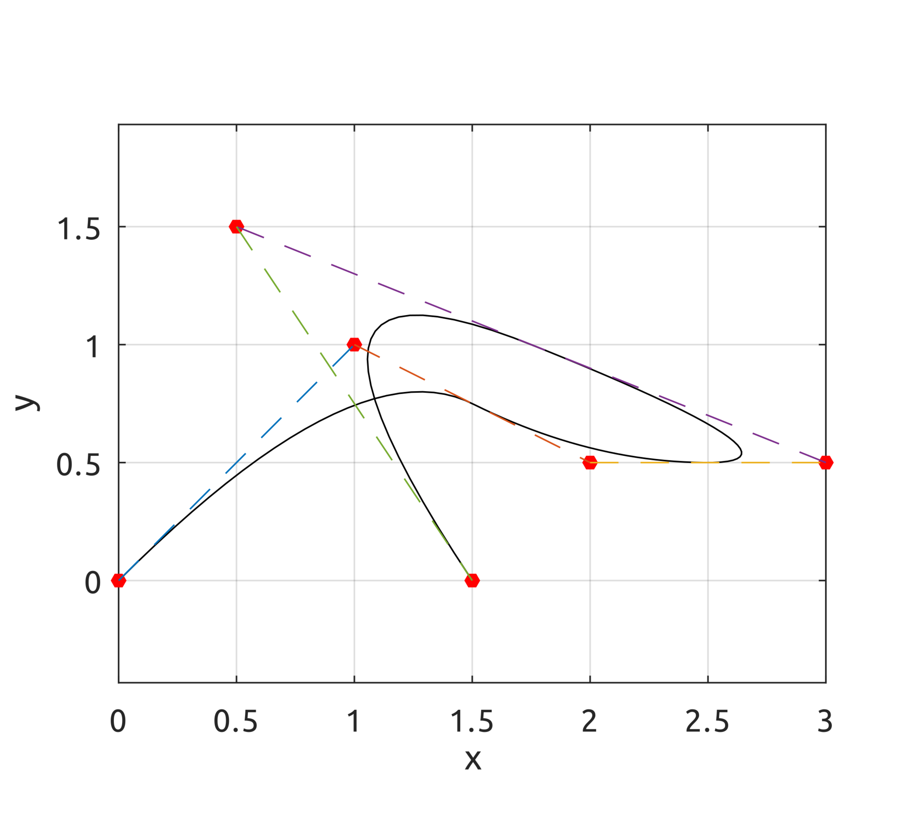

## B-Spline
### drawBsplineBasisFuns

### drawBsplineBasisDerivs
Computes and draws b-spline basis functions and their derivatives.

    drawBsplineBasisDerivs([0, 0, 0, 0, 1, 4, 6, 8, 8, 8, 8],3);

    drawBsplineBasisDerivs([0, 0, 0, 1, 2, 3, 4, 4, 5, 5, 5],2);

### drawBsplineCurve
Draws a b-spline curve.

    drawBsplineCurve(5, 2, [0, 0, 0, 0.25, 0.5, 0.75, 1, 1, 1], [0, 0; 1, 1; 2, 0.5; 3, 0.5; 0.5, 1.5; 1.5, 0]);

    drawBsplineCurve(5, 2, [0, 0, 0, 0.25, 0.5, 0.75, 1, 1, 1], [0, 0, 0; 1, 1, 1; 2, 0.5, 0; 3, 0.5, 0; 0.5, 1.5, 0; 1.5, 0, 1]);

### drawBivariateBsplineBasisFuns
Draws bivariate basis functions.

    drawBivariateBsplineBasisFuns([0, 0, 0, 0.5, 1, 1, 1], 3, 2, [0, 0, 0, 0.5, 1, 1, 1], 3, 2);

### drawBsplineSurf
Draws a b-spline surface.

    drawBsplineSurfDemo

