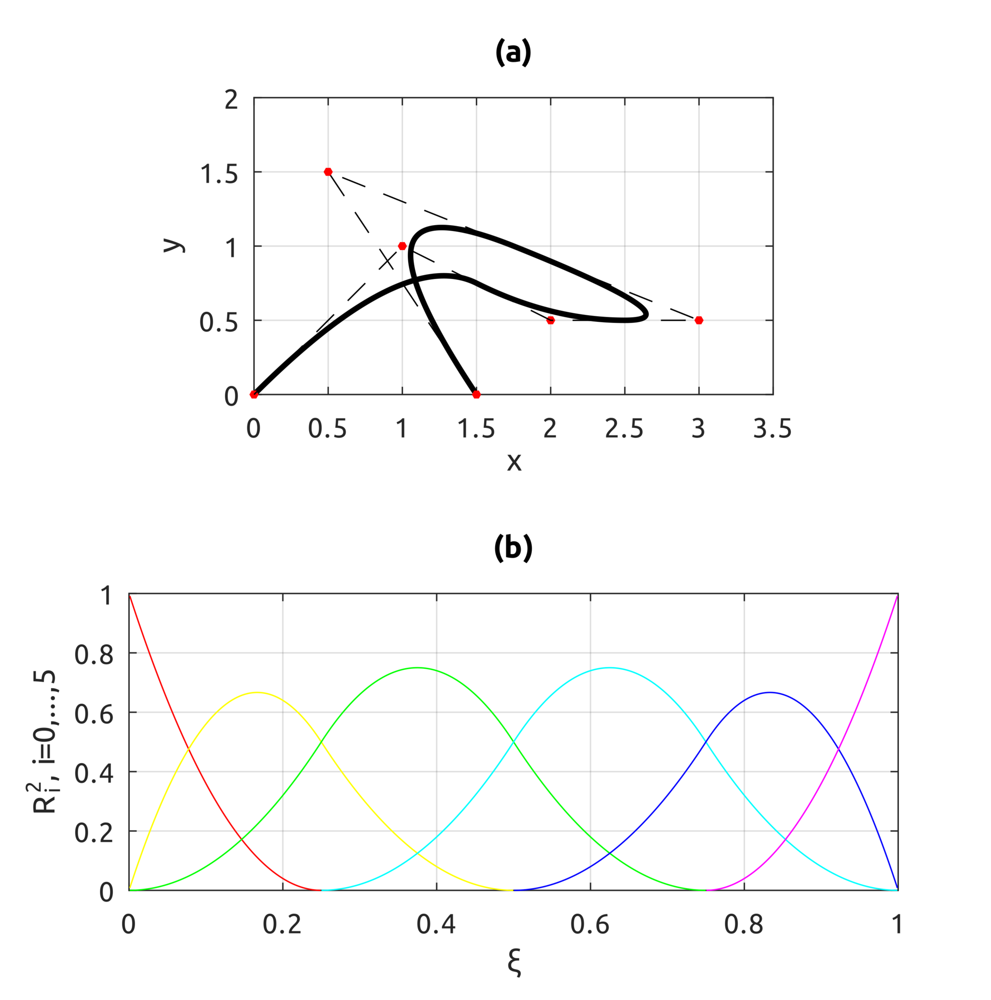

## NURBS
NOTE: code in this directory needs code in 3.4.

### drawNURBSBasisFunsP5
Draws NURBS basis funs of degrees in [0, 5].

### drawNURBSBasisDerivs

### drawNURBSCircle
Draws a circle using NURBS.

### drawNURBSExampleCurve
Shows the effect of different weights on the NUBS curve.

