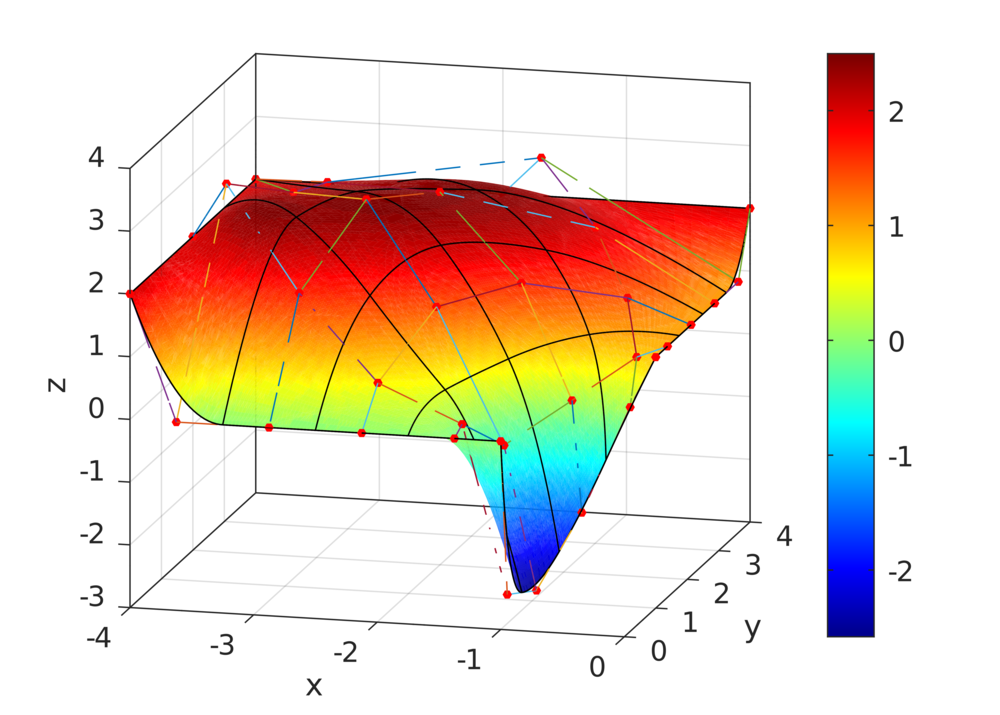

### IGA2D56

Solution of the problem:

    ∇(∇u(x)) = 1, ∀x ∈ Ω
    u(x) = 1, ∀x ∈ Γ
    u(x) = 0, ∀x ∈ ∂Ω \ Γ

on a plate with hole, where Ω is the domain of the plate, and two Dirichlet conditions are applied to the border.

### IGA2D513

Solution of the problem:

    ∇(∇u(x)) = 1, ∀x ∈ Ω
    u(x) = 0, ∀x ∈ Γ_D,0
    u(x) = 1, ∀x ∈ Γ_D,1
    u(x) = 2, ∀x ∈ Γ_D,2
    ∂u(x)/∂v = 9x, ∀x ∈ Γ_N

on a plate with hole, where Γ represent a subset of the border, D means condition is Dirichlet and N is a Neumann condition.

