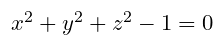
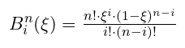
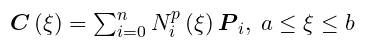
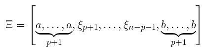
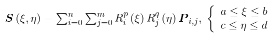

# Isogeometric Analysis and Finite Element Method with Octave

## More Details on the Project

* Link to dissertation: https://bugfreeblog.page.link/isogeometric-analysis-dissertation.
* Link to presentation: https://bugfreeblog.page.link/isogeometric-analysis-presentation.
* FEM: [blog post](https://thebugfreeblog.blogspot.com/2021/04/igafem.html).
* Bezier curves and surfaces: [blog post](https://thebugfreeblog.blogspot.com/2021/05/isogeometric-analysis-bezier-curves-and.html).

## Intro

The repo contains code to show how to implement FEM/IGA, coming from my dissertation (link below). The scripts include functions that implement the algorithms (typically with the "compute" prefix) and scripts that show how to use the functions and the result on real examples (typically with the "draw" prefix). Main topic is Isogeometric Analysis (IGA), but some code is there also for the Finite Element Method (FEM). The code was mostly written in 2009 for Matlab. In 2021 I improved it a bit and patched it to work with **Octave**, which seems to work very well. The repo contains:

* 2.3: code showing how to solve 1D problems using the Finite Element Method (FEM);
* 3.1: examples on how to draw curves and surfaces with implicit and parametric equations;
* 3.3: implementation of Bezier curves and surfaces with examples;
* 3.4: implementation of B-spline basis functions, curves and surfaces with examples;
* 3.5: implementation of NURBS basis functions, curves and surfaces with examples;
* 4.5: implementation of IGA on 1D problems with B-splines and NURBS, including h-refinement via knot insertion and degree elevation;
* 4.6: Gauss points and weights to speed up numerical quadrature for IGA;
* 4.7: implementation of IGA on 2D problems with numerical examples.

Note that the implementation is in no way optimized for speed. Computation of IGA solutions may take hours to complete and show the final result.

## [Finite Element Method (FEM)](2.3)

FEM is the main method used to numerically solve differential equations. The dissertation includes examples of solutions of 1D and 2D problems using this technique, but the 2D implementation uses Matlab/SimuLink, so it would need a specific implementation in Octave. 1D problems are showed instead in 2.3:

results in:

Lagrande polynomials can be useful for the definition of nodal shape functions:

See [this blog post](https://thebugfreeblog.blogspot.com/2021/04/igafem.html) for more info.

## [Curves and Surfaces with Implicit and Parametric Forms](3.1)

Examples for drawing implicit and parametric equations:

## [Bezier Curves and Surfaces](3.3)

Implementation of Bezier curves and surfaces:

See [this blog post](https://thebugfreeblog.blogspot.com/2021/05/isogeometric-analysis-bezier-curves-and.html) for more info.

## [B-spline Curves and Surfaces](3.4)

Implementation of B-spline curves and surfaces:

## [NURBS Curves and Surfaces](3.5)

Implementation of NURBS curves and surfaces:

## Isogeometric Analysis with Knot Insertion

[Chapter 4.5](4.5) includes algorithms for knot insertion, to refine the approximation:

In chapter 4.6 I created weights and Gauss points to speed up numerical quadrature during the IGA process.

In [chapter 4.7](4.7) there are more examples of solving 2D problems with IGA, (e.g.):

## Links

The code was tested on [**GNU Octave version 6.2.0**](https://www.gnu.org/software/octave/index).